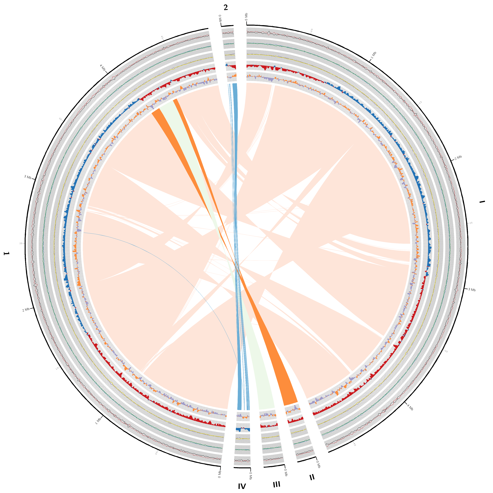

# BINF6110 Assignment 1: Using Bioinformatic Research Tools to Assemble the Bacterial Genome of *Salmonella enterica* 
## Introduction

Bacterial infections constitute a major public health burden and are responsible for significant levels of morbidity and mortality across human and animal populations. [1, 2] The diverse host invasion strategies employed by pathogenic bacteria, together with the rapid evolution of antibiotic resistance, highlight the need for a comprehensive understanding of the molecular and cellular mechanisms underlying bacterial virulence and host-pathogen interactions. Advances in high-throughput genome sequencing technologies, coupled with modern bioinformatics tools, have substantially facilitated bacterial genome analysis. [2] The availability of high-quality, accurately reconstructed genomes is essential for these analyses, emphasizing genome assembly as a fundamental step in bacterial genomics. [3]

*Salmonella enterica* is a gram-negative, facultative intracellular bacterium with more than 2,600 distinct serovars. [4, 5] As a highly adaptable environmental microorganism, it occupies a wide range of reservoirs and represents a major pathogen of both humans and animals. Human infection can result in salmonellosis, which may be severe or, in some cases, fatal [6]. The *S. enterica* genome is approximately 4.8 Mb in size and is characterized by high gene density and the presence of diverse mobile genetic elements, including plasmids and prophages. [7, 8] Given its significant public health relevance and extensive serovar diversity, S. enterica is a well-suited model for bacterial genome assembly and comparative genomic analyses. Furthermore, numerous high-quality, well-annotated reference genomes are publicly available, allowing for effective validation of assembled genomes. [7]

Reconstructing a bacterial genome from sequencing reads requires technologies capable of achieving high sequence coverage, minimal fragmentation, and sufficient accuracy, while also maintaining short turnaround times to accommodate rapid bacterial evolution. [9, 10]  Oxford Nanopore Technologies (ONT) R10 sequencing has enabled the generation of near-complete microbial genomes with coverage exceeding 40-fold, in some cases without the need for additional short-read polishing. [11] Furthermore, ONT sequencing is rapid and efficient, supporting real-time base calling and analysis, which is particularly advantageous for time-sensitive applications such as outbreak response.[12] Despite these advantages, ONT-derived assemblies may exhibit systematic base-calling errors, particularly at methylated genomic positions, and long reads can span highly repetitive regions that complicate accurate assembly. [10, 13] To mitigate these limitations, post-assembly polishing strategies are commonly employed to improve consensus accuracy and produce high-quality microbial genome assemblies. [14] 

Before the advent of autonomous long-read assemblers, bacterial genome assembly was labour-intensive and limited in its ability to resolve repetitive genomic regions. [15] Flye was developed as an automated de novo assembler optimized for long-read sequencing data, enabling efficient and accurate genome reconstruction. The tool employs a repeat graph–based approach to resolve repetitive regions and generate contiguous genome assemblies [13]. Comparative studies have shown that Flye generates more accurate and contiguous assemblies than other state-of-the-art single-molecule sequencing assemblers, while also effectively reconstructing mosaic segmental duplication structures.¹³ Despite these advantages, base-calling errors introduced during Oxford Nanopore sequencing can propagate into the initial assembly. Post-assembly polishing tools address these residual errors, improving overall accuracy to levels comparable with short-read sequencing approaches. [14] Among Nanopore polishing methods, Medaka has been shown to produce high-quality, low-error genomes suitable for downstream analyses. [14]

Once a high-quality consensus genome has been assembled and polished, comparison to a well-annotated reference genome enables the identification and characterization of sequence variation.[16] Alignment to a reference strain facilitates the detection of single-nucleotide polymorphisms (SNPs) and insertions/deletions (indels), which are essential for understanding strain-level differences and evolutionary processes in bacterial genomes.[16] For reference-based mapping of long-read sequencing data, minimap2 is widely regarded as a benchmark method.[17] It employs a seed–chain–align strategy to map long sequencing reads to reference genomes, achieving high accuracy and computational efficiency relative to other domain-specific alignment tools.[18] Although minimap2 enables efficient alignment of large-scale genomic datasets, the resulting alignments can be challenging to interpret without visualization. The Integrative Genomics Viewer (IGV) addresses this by using efficient, multi-resolution file formats that support real-time exploration of large genomic datasets with minimal computational expense. [19] 

This study evaluates a computational pipeline for bacterial genome assembly using Oxford Nanopore R10 sequencing data to assemble and polish a Salmonella enterica genome, followed by reference-based comparison to identify and visualize sequence variation.

## Methods
### Sequencing Data Acquisition
Oxford Nanopore sequencing reads generated using R10 chemistry (expected accuracy Q20+, N50: 5–15 kb) were retrieved in FASTQ format from the NCBI Sequence Read Archive using the SRA Toolkit (accession SRR32410565). Raw reads were used directly for downstream analyses to avoid reference bias. Read length and quality distributions were evaluated using seqtk summary statistics to confirm suitability for long-read genome assembly. Overall sequencing quality was further assessed using FastQC, which generated summary metrics including per-base sequence quality, GC content, sequence duplication levels, and potential adapter contamination.

### Genome Assembly
De novo genome assembly was performed using Flye (v2.9.2), an autonomous long-read assembler optimized for error-prone single-molecule sequencing data such as those generated by Oxford Nanopore sequencing. [13] Assembly was conducted using the --nano-hq parameter to specify high-quality Nanopore input reads, while all other parameters were retained at default settings to minimize manual bias. Flye employs a repeat graph-based assembly approach, enabling effective resolution of repetitive genomic regions and the generation of contiguous genome assemblies. Assembly quality was evaluated using QUAST [20], which provides metrics such as N50, total assembly length, and contiguity, and BUSCO [21], which assesses genome completeness based on the presence of conserved single-copy orthologs. 

### Assembly Polishing
To improve consensus accuracy and mitigate base-calling errors associated with Oxford Nanopore sequencing, post-assembly polishing was performed using Medaka (v1.7.3) [14]. Medaka applies neural network–based models trained on Oxford Nanopore data to correct systematic sequencing errors. The appropriate Medaka model corresponding to R10 chemistry was selected (r1041_e82_400bps_sup_v5.0.0), and polishing was conducted using default settings to refine the assembled genome before downstream analyses. The polished assembly was reassessed using QUAST and BUSCO to evaluate improvements in contiguity, completeness, and overall assembly quality resulting from polishing.

### Reference Genome Selection
To determine the most appropriate Salmonella enterica reference genome, the first 1,000,000 bases of contig_1 from the Flye assembly were extracted and used as the query sequence for an NCBI nucleotide BLAST analysis. A high-quality, well-annotated Salmonella enterica reference genome (NCBI Assembly ASM694v2) was retrieved from the NCBI Assembly database [7]. This reference genome was selected based on its BLAST similarity scores, completeness and annotation quality, providing a reliable framework for comparative analyses and variant detection.

### Read Alignment to Reference Genome
Polished sequencing reads were aligned to the reference genome using minimap2 (v2.26), a widely used and benchmarked aligner for long-read sequencing data [17]. Alignments were performed in two steps: first, raw reads were aligned to the reference genome for variant calling using the -ax map-ont preset, which is optimized for Oxford Nanopore reads and balances alignment accuracy with computational efficiency; second, the assembled genome was aligned to the reference genome for structural analysis using the -ax asm5 preset, optimized for assembly-to-assembly alignments. Resulting alignments were stored in BAM format for downstream analyses. The polished and assembled *Salmonella enterica* genome was annotated using Prokka, a software tool for rapid prokaryotic genome annotation. [22] Genome synteny between the polished and assembled genomes and the reference genome was visualized using a SYNY Circos plot, which infers collinearity from pairwise genome alignments generated with minimap2. [23] 

### Variant Identification and Visualization
Aligned reads were used to identify sequence variation between the assembled genome and the reference genome. Variants of interest included single-nucleotide polymorphisms (SNPs) and insertions/deletions (indels), which provide insight into strain-level differences and evolutionary divergence.[16] Genomic alignments and detected variants were ​​visualized using bcftools and IGV (v2.16.2) to enable interactive inspection of alignments and variants [19, 24]

## Results

### Sequencing Data Quality and Characteristics
Seqtk and FastQC analyses indicated that 196,031 Nanopore reads were obtained, totalling 809.2 Mbp of sequence data. Read lengths ranged from 9 to 58,041 bases, with an overall GC content of 52%. No significant adaptor contamination or overrepresented sequences were detected, and sequence duplication levels were minimal. The Salmonella enterica Nanopore reads had an average Phred quality score greater than 30, consistent with high-quality sequence data.

### Reference Genome Identification and De Novo Genome Assembly Metrics 
De novo assembly with Flye produced four contigs totalling 5,147,510 bp. The first 1,000,000 bases of contig_1 were extracted and used as the query for an NCBI nucleotide BLAST search, which returned a 99.99% identity match to the Salmonella enterica subsp. enterica serovar Typhimurium strain LT2 complete genome (NCBI Assembly ASM694v2). The alignment exhibited 96% query coverage and an E-value of 0, indicating a highly significant match, and was therefore selected as the reference genome for downstream analyses. (Figure 1)

  

  <small>
    <b>Figure 1. NCBI Nucleotide BLAST Query.</b> Query search using the first 1,000,000 bases of contig_1 returned a 99.99% identity match to <i>Salmonella enterica</i> subsp. <i>enterica</i> serovar Typhimurium strain LT2 complete genome.
  </small>

According to the QUAST report, the largest contig (contig_1) was 4,708,308 bp in length, corresponding to the N50, with an L50 of 1. The assembly covered 95.67% of the reference genome, with the largest alignment length of 953,685 bp and a duplication ratio of 1.005. Together, these metrics indicate that most of the de novo assembly aligned successfully to the reference genome, although some contigs likely contain overlapping regions and/or misassembled repetitive sequences. QUAST identified 28 misassemblies, all classified as relocation events, supporting the presence of overlapping or misaligned contig regions relative to the reference. Further inspection using QUAST Icarus showed that contig_2 aligned correctly to the reference genome, contigs_1 and _3 contained misaligned relocations, and contig_4 did not align to the reference genome.

BUSCO output files analyzing the de novo genome using the bacteria_odb12 dataset identified 114 of 116 (98.3%) expected universal single-copy bacterial orthologs as complete. All complete BUSCOs were present in a single copy, with no duplicated or fragmented genes detected. Only two BUSCOs (1.7%) were missing, a level commonly observed in high-quality bacterial genome assemblies. Collectively, these results indicate a highly complete and contiguously assembled bacterial genome.

### Assembly Polishing Effect on Genome Quality
Following Medaka-based polishing, genome assembly quality and completeness were reassessed using QUAST and BUSCO. Comparative analysis indicated no meaningful changes in overall assembly structure or alignment metrics between the unpolished and polished de novo assemblies (Table 1). Assembly coverage and duplication ratio were identical for both assemblies (95.67% and 1.005). The largest alignment length increased by 2 bp in the polished assembly (953,687 bp). The number of misassemblies remained constant at 28, all classified as relocation events, and the lengths of misassembled contigs increased by 2 bp. The number of mismatches per 100 kb increased by 0.4, while indels per 100 kb increased by 0.005.

  <b>Table 1. QUAST alignment-based assembly metrics before and after Medaka polishing. </b> Alignment-based statistics reported by QUAST for the initial de novo genome assembly and the Medaka-polished assembly, including genome fraction, duplication ratio, alignment lengths, misassembly counts, and rates of mismatches and indels per 100 kbp.

| Alignment-based statistics    | Initial Assembled Genome | Polished Assembled Genome |
|------------------------------|-------------------------:|--------------------------:|
| Genome fraction (%)          | 95.67                    | 95.67                     |
| Duplication ratio            | 1.005                    | 1.005                     |
| Largest alignment            | 953685                   | 953687                    |
| Total aligned length         | 4,762,956                | 4,762,958                 |
| # misassemblies              | 28                       | 28                        |
| Misassembled contigs length  | 4,855,832                | 4,855,834                 |
| # mismatches per 100 kbp     | 28.64                    | 29.04                     |
| # indels per 100 kbp         | 4.28                     | 4.33                      |

### Alignment to Reference Genome, Genome Annotation and Synteny
The Medaka-polished Salmonella enterica genome assembly was aligned to the reference genome using Minimap2 with the -ax asm5 preset, which is optimized for assembly-to-assembly comparisons. Alignments were generated in BAM format and inspected in IGV to assess genome coverage and structural consistency. The polished assembly exhibited strong, contiguous coverage across the reference genome, with no evidence of large-scale structural differences. A limited number of single-nucleotide polymorphisms (SNPs) and short insertions or deletions (indels) were observed, consistent with expected strain-level variation. Overall, the assembly was highly colinear with the reference genome (Figure 2).

The polished assembly was annotated using Prokka, enabling identification of coding sequences, rRNAs, tRNAs, and other genomic features. Genome synteny between the polished assembly and the reference was further visualized using a SYNY Circos plot, which summarizes pairwise genome alignments generated by Minimap2 and highlights conserved genomic blocks as well as potential structural rearrangements (Figure 3). Coverage and variation tracks were largely uniform across the genome, indicating consistent alignment and assembly quality. A large chromosomal inversion was observed, along with several smaller structural rearrangements. No major deletions or large-scale misassemblies were detected, supporting the high structural accuracy of the assembled genome.

  

  <small>
    <b>Figure 2. IGV Visualization of the Polished Salmonella enterica Genome Assembly Aligned to the Reference Genome.</b> The polished assembly was aligned using Minimap2 and visualized in IGV. The sequence track displays reference codons with the translated amino acid sequence shown in dark blue, and the corresponding annotated gene (nuoL) indicated below. The assembled genome sequence is represented by gray alignment blocks, with single-nucleotide polymorphisms (SNPs) highlighted by green and orange blocks at specific positions. Read coverage across the region is continuous, with no evidence of large structural variation, and observed differences are limited to localized SNPs and short insertions or deletions.
  </small>

  

  <small>
    <b>Figure 3. Circos plot of Genome Synteny Between the Medaka-polished Salmonella enterica Assembly and the Reference Genome. </b> Outer tracks display genome coordinates, read coverage, and sequence variation. The assembled genome contigs are labeled with Roman numerals (I–IV), while the reference genome segments are labeled numerically (1–2). Internal ribbons represent pairwise alignments between assembly contigs and the reference, revealing extensive overall synteny, a large chromosomal inversion, and minor structural rearrangements, with no evidence of major deletions or misassemblies.
  </small>

### Variant Identification
Aligned Nanopore reads were used to identify sequence variation relative to the reference genome, providing insight into strain-level differences and potential evolutionary divergence. Variants were identified using bcftools and inspected in IGV (v2.16.2), enabling both quantitative assessment and interactive visualization of read alignments and variant positions. 

Variant calling identified 9,407 total variant records, comprising 9,337 single-nucleotide polymorphisms (SNPs) and 70 short insertions or deletions (indels) relative to the Salmonella enterica serovar Typhimurium LT2 reference genome (Figure 2). No multiallelic sites, multi-nucleotide polymorphisms (MNPs), or complex variants were detected, consistent with haploid variant calling and a clonal bacterial genome. SNPs accounted for >99% of all variants, indicating a low indel burden and overall high-quality variant detection. 

A total of 4,821 transitions and 4,516 transversions were observed, yielding a transition/transversion (Ts/Tv) ratio of 1.07. This value is consistent with the known error profile of Nanopore sequencing and supports the use of conservative filtering to retain high-confidence variant calls. Together, these results indicate reliable identification of sequence variation suitable for downstream comparative and evolutionary analyses.

  <b>Table 2. Summary of Variant Calling Statistics. </b> Variants were identified relative to the Salmonella enterica serovar Typhimurium LT2 reference genome using Nanopore sequencing data. The absence of multiallelic sites is consistent with haploid variant calling, and the observed Ts/Tv ratio reflects the expected error profile of Nanopore reads after conservative filtering.

| Feature                  | Value | Description                                   |
|--------------------------|-------|-----------------------------------------------|
| Number of samples        | 1     | Single haploid bacterial genome               |
| Total variant records    | 9,407 | Total high-confidence variant sites           |
| SNPs                     | 9,337 | Single-nucleotide polymorphisms               |
| Indels                   | 70    | Short insertions and deletions                |
| MNPs                     | 0     | Multi-nucleotide polymorphisms                |
| Other variant types      | 0     | Structural or complex variants                |
| Multiallelic sites       | 0     | Sites with >1 alternate allele                |
| Multiallelic SNP sites   | 0     | Confirms haploid variant calling              |
| Transitions (Ts)         | 4,821 | A↔G and C↔T substitutions                    |
| Transversions (Tv)       | 4,516 | Purine↔pyrimidine substitutions              |
| Ts/Tv ratio              | 1.07  | Indicator of variant call quality             |

## Discussion

Addressing the major public health burden posed by bacterial infections requires a detailed understanding of host invasion strategies and the molecular mechanisms underlying antibiotic resistance, both of which depend on high-quality, accurately reconstructed genomes. In this study, we evaluated a computational pipeline for Oxford Nanopore–based genome assembly and polishing of Salmonella enterica, combined with reference-based comparative analyses to assess genome synteny and sequence variation. The resulting assembly exhibited strong quality metrics, including high contiguity as assessed by QUAST and high completeness based on BUSCO analysis. (Table 1) Comparative alignment to the LT2 reference genome revealed extensive synteny, while variant analysis demonstrated that sequence divergence was dominated by single-nucleotide polymorphisms with a low indel burden. (Table 2) Together, these results highlight the ability of modern long-read sequencing and bioinformatics tools to enable rapid, high-quality bacterial genome assembly and comparative analysis, supporting investigations into bacterial evolution, virulence, and host–pathogen interactions.
  
The high BUSCO completeness score (98.3%) indicates that the vast majority of expected single-copy bacterial genes were successfully recovered, supporting biological completeness and important gene content recovery of the assembled Salmonella enterica genome. [21] The existence of multiple contigs and QUAST-identified relocation-type misassemblies is consistent with previous observations in long-read–only assemblies, typically associated with repetitive regions or structural complexity rather than an assembly failure. [25] Minimap2-based comparative alignment and synteny analysis revealed a largely colinear genome structure relative to the reference, except for a prominent chromosomal inversion. (Figure 3) This inversion may reflect genuine strain-specific structural variation, as chromosomal rearrangements have been documented among S. enterica isolates, typically due to recombination between operons. [26] Rearrangements may also arise from alignment or assembly ambiguity in repetitive genomic regions. [25] Importantly, the presence of this inversion does not substantially compromise overall assembly quality, as genome coverage remained high and no large-scale deletions or fragmented regions were detected. All together, the observed contiguity, completeness, and structural consistency are consistent with expectations for high-quality Nanopore-only bacterial genome assemblies and support the reliability of the assembled genome for downstream comparative and evolutionary analyses.

Medaka polishing had little to no effect on assembly quality, likely due to the high accuracy of R10 reads and Flye’s consensus-optimized finishing approach [11,13]. Minor fluctuations in mismatch and indel rates after polishing are expected and reflect small base-level adjustments rather than meaningful degradation. [9] These changes are minor relative to genome size and do not affect contiguity, gene completeness, or structural accuracy. Similar results have been reported for Oxford Nanopore R10 data, where additional polishing after a high-quality consensus yields diminishing returns and only marginal shifts in error metrics [9, 11]. 

Variant calling revealed that sequence variation was overwhelmingly dominated by single-nucleotide polymorphisms, which accounted for more than 99% of all detected variants, a pattern expected for closely related Salmonella enterica strains. [4] The absence of multiallelic sites further supports clonal, haploid variant calling and indicates consistent read calls across variant positions. The low frequency of short insertions and deletions suggests reliable read alignments and the application of conservative filtering criteria, minimizing the inclusion of false-positive indel calls. The observed transition/transversion ratio of 1.07 is consistent with known error profiles of Oxford Nanopore sequencing and indicates that variant calling reflected patterns consistent with true biological variation. Gene-level inspection of variant positions revealed that several SNPs occurred within annotated coding regions. For example, visualization in IGV identified a single-nucleotide polymorphism within the nuoL gene, which encodes a subunit of NADH dehydrogenase I involved in cellular respiration. [27] (Figure 2) This variant resulted in a missense substitution, while nearby SNPs were synonymous, indicating amino acid–altering and silent mutations, respectively. The absence of frameshift or nonsense mutations suggests that core protein structure is likely preserved. Consistent read support across this locus supports the reliability of the call and indicates that the observed variation reflects strain-level sequence divergence rather than sequencing artifact. Although no functional assays were performed, such coding-region SNPs may contribute to subtle physiological differences and are suitable targets for further comparative or evolutionary analyses.

This study highlights several strengths of the applied computational pipeline. Long-read Oxford Nanopore sequencing enabled the generation of a highly contiguous genome assembly and facilitated the resolution of repetitive genomic regions that are often challenging for short-read approaches. [13] Integration of several visualization tools, including IGV and Circos-based synteny plots, strengthened confidence in both structural accuracy and variant calls, while utilization of a reproducible, reference-guided framework allowed for robust comparative analysis. Several limitations, however, should be acknowledged. Analyses were conducted relative to a single reference genome (NCBI Assembly ASM694v2), which may limit the detection of more divergent or strain-specific sequence features. Despite polishing to resolve residual base-calling errors, sequence errors may persist in the assembled genome, particularly at methylated sites. [28] Additionally, the lack of short-read validation limits direct evaluation of base-level accuracy, and biological interpretation was therefore largely confined to structural and sequence-level analyses. Future work could address these limitations through hybrid assembly and polishing with Illumina sequence data, functional annotation of SNPs affecting coding regions, and phylogenetic analysis using SNPs shared across the core genome. This computational framework is well-suited for applications in bacterial outbreak surveillance and antimicrobial resistance studies, highlighting the potential of long-read sequencing-based genome assembly and comparative analysis in public health and microbial genomics.

## Works Cited
1. Doron, S., & Gorbach, S. L. (2008). Bacterial Infections: Overview. International Encyclopedia of Public Health, 273–282. https://doi.org/10.1016/B978-012373960-5.00596-7
2. Donkor E. S. (2013). Sequencing of bacterial genomes: principles and insights into pathogenesis and development of antibiotics. Genes, 4(4), 556–572. https://doi.org/10.3390/genes4040556
3. Kumar, M. S., Krishna, M. B., Soman, K. P., Stanley, J., Pourmand, N., Suravajhala, P., & Babu, T. G. S. (2025). Benchmarking long-read assembly tools and preprocessing strategies for bacterial genomes: A case study on E. coli DH5α. Biotechnology reports (Amsterdam, Netherlands), 48, e00931. https://doi.org/10.1016/j.btre.2025.e00931 
4. Andino, A., Hanning, I., Salmonella enterica: Survival, Colonization, and Virulence Differences among Serovars, The Scientific World Journal, 2015, 520179, 16 pages, 2015. https://doi.org/10.1155/2015/520179 
5. Brown EW, Bell R, Zhang G, Timme R, Zheng J, Hammack TS, Allard MW.2021.Salmonella Genomics in Public Health and Food Safety. 9:eESP-0008-2020.https://doi.org/10.1128/ecosalplus.ESP-0008-2020 
6. Gourama, H. (2020). Foodborne Pathogens. In: Demirci, A., Feng, H., Krishnamurthy, K. (eds) Food Safety Engineering. Food Engineering Series. Springer, Cham. https://doi.org/10.1007/978-3-030-42660-6_2
7. National Center for Biotechnology Information (NCBI). Salmonella enterica genome assembly ASM250787v2. NCBI Assembly database. https://www.ncbi.nlm.nih.gov/assembly/ASM250787v2
8. Andrews, K., Landeryou, T., Sicheritz-Pontén, T., & Nale, J. Y. (2024). Diverse Prophage Elements of Salmonella enterica Serovars Show Potential Roles in Bacterial Pathogenicity. Cells, 13(6), 514. https://doi.org/10.3390/cells13060514
9. Wick, R. R., Judd, L. M., & Holt, K. E. (2023). Assembling the perfect bacterial genome using Oxford Nanopore and Illumina sequencing. PLoS computational biology, 19(3), e1010905. https://doi.org/10.1371/journal.pcbi.1010905
10. Bogaerts B, Maex M, Commans F, Goeders N, Van den Bossche A, De Keersmaecker SCJ, Roosens NHC, Ceyssens P, Mattheus W, Vanneste K.2025.Oxford Nanopore Technologies R10 sequencing enables accurate cgMLST-based bacterial outbreak investigation of Neisseria meningitidis and Salmonella enterica when accounting for methylation-related errors. JClinMicrobiol63:e00410-25.https://doi.org/10.1128/jcm.00410-25
11. Sereika, M., Kirkegaard, R.H., Karst, S.M. et al. Oxford Nanopore R10.4 long-read sequencing enables the generation of near-finished bacterial genomes from pure cultures and metagenomes without short-read or reference polishing. Nat Methods 19, 823–826 (2022). https://doi.org/10.1038/s41592-022-01539-7
12. Kono N, Arakawa K. Nanopore sequencing: Review of potential applications in functional genomics. Develop Growth Differ. 2019; 61: 316–326. https://doi.org/10.1111/dgd.12608
13. Kolmogorov, M., Yuan, J., Lin, Y. et al. Assembly of long, error-prone reads using repeat graphs. Nat Biotechnol 37, 540–546 (2019). https://doi.org/10.1038/s41587-019-0072-8
14. Lee, J.Y., Kong, M., Oh, J. et al. Comparative evaluation of Nanopore polishing tools for microbial genome assembly and polishing strategies for downstream analysis. Sci Rep 11, 20740 (2021). https://doi.org/10.1038/s41598-021-00178-w
15. Mihai Pop, Genome assembly reborn: recent computational challenges, Briefings in Bioinformatics, Volume 10, Issue 4, July 2009, Pages 354–366, https://doi.org/10.1093/bib/bbp026
16. Olson, N. D., Lund, S. P., Colman, R. E., Foster, J. T., Sahl, J. W., Schupp, J. M., Keim, P., Morrow, J. B., Salit, M. L., & Zook, J. M. (2015). Best practices for evaluating single nucleotide variant calling methods for Microbial Genomics. Frontiers in Genetics, 6. https://doi.org/10.3389/fgene.2015.00235 
17. Liyanage, K., Samarakoon, H., Parameswaran, S. et al. Efficient end-to-end long-read sequence mapping using minimap2-fpga integrated with hardware accelerated chaining. Sci Rep 13, 20174 (2023). https://doi.org/10.1038/s41598-023-47354-8
18. Heng Li, Minimap2: pairwise alignment for nucleotide sequences, Bioinformatics, Volume 34, Issue 18, September 2018, Pages 3094–3100, https://doi.org/10.1093/bioinformatics/bty191
19. Robinson, J. T., Thorvaldsdóttir, H., Winckler, W., Guttman, M., Lander, E. S., Getz, G., & Mesirov, J. P. (2011). Integrative genomics viewer. Nature biotechnology, 29(1), 24–26. https://doi.org/10.1038/nbt.1754
20. Alexey Gurevich, Vladislav Saveliev, Nikolay Vyahhi, Glenn Tesler, QUAST: quality assessment tool for genome assemblies, Bioinformatics, Volume 29, Issue 8, April 2013, Pages 1072–1075, https://doi.org/10.1093/bioinformatics/btt086
21. Felipe A. Simão, Robert M. Waterhouse, Panagiotis Ioannidis, Evgenia V. Kriventseva, Evgeny M. Zdobnov, BUSCO: assessing genome assembly and annotation completeness with single-copy orthologs, Bioinformatics, Volume 31, Issue 19, October 2015, Pages 3210–3212, https://doi.org/10.1093/bioinformatics/btv351
22. Torsten Seemann, Prokka: rapid prokaryotic genome annotation, Bioinformatics, Volume 30, Issue 14, July 2014, Pages 2068–2069, https://doi.org/10.1093/bioinformatics/btu153
23. Jean-Francois Pombert, & Alexander Thomas Julian. (2025). PombertLab/SYNY: SYNY-v1.3.1 (1.3.1). Zenodo. https://doi.org/10.5281/zenodo.18007981
24. Danecek, P., Bonfield, J. K., Liddle, J., Marshall, J., Ohan, V., Pollard, M. O., Whitwham, A., Keane, T., McCarthy, S. A., Davies, R. M., & Li, H. (2021). Twelve years of SAMtools and BCFtools. GigaScience, 10(2), giab008. https://doi.org/10.1093/gigascience/giab008
25. Trigodet, F., Sachdeva, R., Banfield, J.F. et al. Troubleshooting common errors in assemblies of long-read metagenomes. Nat Biotechnol (2026). https://doi.org/10.1038/s41587-025-02971-8
26. Matthews, T. D., Rabsch, W., & Maloy, S. (2011). Chromosomal rearrangements in Salmonella enterica serovar Typhi strains isolated from asymptomatic human carriers. mBio, 2(3), e00060–e11. https://doi.org/10.1128/mBio.00060-11
27. Archer, C. D., & Elliott, T. (1995). Transcriptional control of the nuo operon which encodes the energy-conserving NADH dehydrogenase of Salmonella typhimurium. Journal of bacteriology, 177(9), 2335–2342. https://doi.org/10.1128/jb.177.9.2335-2342.1995
28. Chen, Z., Ni, P., & Wang, J. (2025). Identifying DNA methylation types and methylated base positions from bacteria using nanopore sequencing with multi-scale Neural Network. Bioinformatics, 41(8). https://doi.org/10.1093/bioinformatics/btaf397 

